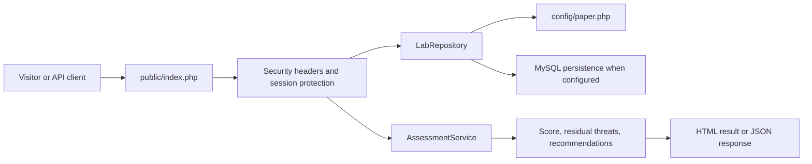
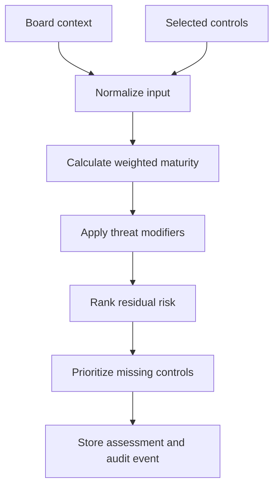

# Architecture

The platform is organized as a small PHP/MySQL application that can be extended without changing the assessment model.

## Layers

1. Web interface

   `public/index.php` provides the dashboard, assessment form, control catalog, paper page, health endpoint, and JSON endpoints.

2. Service layer

   `src/Service/AssessmentService.php` normalizes assessment input, calculates weighted maturity, ranks residual threats, and returns prioritized actions.

3. Repository layer

   `src/Repository/LabRepository.php` exposes paper metadata, threats, controls, scenarios, and optional MySQL persistence for assessment history.

4. Configuration catalog

   `config/paper.php` is the source of truth for the paper citation, threat model, control catalog, and SSH scenario model.

5. Persistence layer

   `database/migrations/001_create_core_tables.sql` and `database/seeders/001_seed_research_data.sql` create normalized tables for production data, seed the research catalog, and retain assessment evidence.

## Request Flow

## Assessment Flow

## Extension Points

- Add controls in `config/paper.php` and `database/seeders/001_seed_research_data.sql`.
- Add a new board scenario in the `scenarios` array and `scenario_catalog` seed.
- Replace or augment persistence in `LabRepository`.
- Add authentication middleware before route handling in `public/index.php`.
- Add an evidence upload workflow using the existing assessment identifier.

